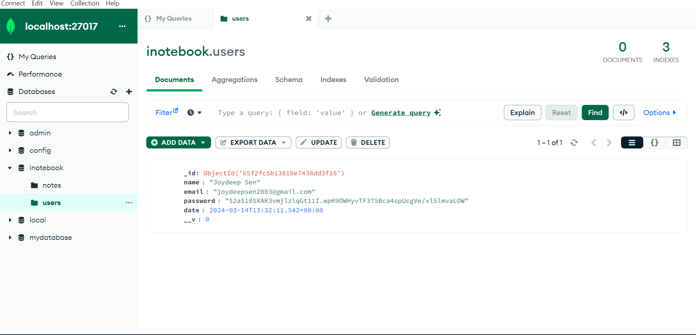

1.  • Techstack: MongoDB, ExpressJS, ReactJS
2.  • Used ExpressJS to create backend-servers and MongoDB for storing data
3.  • To create User Interface used ReactJS for dynamic rendering of contents using DOM-Manipulation
4.  • For User authentication and token Decryption used JSON Web Token (JWT) and Middleware

In the project directory, you can run:

### `npm run both`

Runs the app in the development mode.\
Open [http://localhost:3000](http://localhost:3000) to view it in your browser.

## Screen Shots

### signup Page

### Creating Notes

### save

### Login

### Database user

### Database notes

frontend( add notes , delete and update notes) is handled by Notestate.js 
Modal is used to update notes in Notes.js
